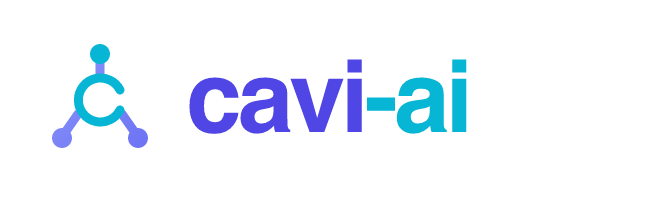

<h1 align="center">
  
</h1>

<p align="center">
  <strong>Infrastructure for building against agent runtimes.</strong><br>
  Gateway-agnostic clients, typed contracts, and graceful degradation — so web,
  mobile, and portal frontends talk to many gateways through one clean surface.
</p>

---

### Packages

| Package | What it does |
| --- | --- |
| [**@cavi-ai/api-client**](https://github.com/cavi-ai/cavi-api-client) | Gateway-agnostic TypeScript client: HTTP + WebSocket RPC, SSE, provider adapters (Hermes / OpenClaw), a runtime team manifest, React bindings, and graceful degradation as a contract. |

```sh
npm install @cavi-ai/api-client
```

### Principles

- **One surface, many gateways.** The transport, RPC protocol, retry, and trace
  behavior are written once; providers override only what genuinely differs.
- **Contracts over conventions.** Route literals and surfaces live in owned
  files, and the package boundary is enforced by tests — not honor system.
- **Degrade, don't crash.** Loaders return typed fallback envelopes with a
  structured contract gap on backend failure, instead of taking down the page.
- **Open and verifiable.** MIT-licensed, pure ESM, published to npm with build
  provenance via OIDC trusted publishing.

---

<p align="center"><sub>MIT licensed · built by <a href="https://github.com/sasan1200">@sasan1200</a></sub></p>
