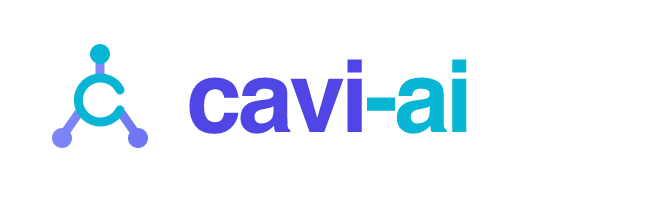

<h1 align="center">
  <a href="https://cavi-ai.xyz"></a>
</h1>

<p align="center">
  <strong>Open research and infrastructure for agent systems.</strong><br>
  We build MIT-licensed tools that make agent runtimes easier to connect, inspect, adapt, and trust.
</p>

<p align="center">
  <a href="https://cavi-ai.xyz"><strong>Visit cavi-ai.xyz →</strong></a>
  ·
  <a href="https://github.com/cavi-ai?tab=repositories">Explore the code</a>
</p>

---

## The CAVI-AI product map

### 01 · Runtime infrastructure

[**CAVI API Client**](https://github.com/cavi-ai/cavi-api-client) is a gateway-agnostic TypeScript client for typed HTTP, WebSocket, and SSE communication with agent runtimes. It provides agent runtime infrastructure through adapters and compatibility surfaces without claiming ownership of an upstream runtime contract.

```sh
npm install @cavi-ai/api-client
```

### 02 · Secure browser automation

[**Bobby Browser**](https://github.com/cavi-ai/bobby-browser) is an alpha browser automation runtime with authenticated, capability-scoped control surfaces across Rust, TypeScript, MCP, and CDP. Its adapters share authorization, evidence, checkpoint, and event contracts.

### 03 · Local AI on Apple Silicon

[**MLX Agent**](https://github.com/cavi-ai/mlx-agent) discovers, verifies, and wires local MLX-optimized models on Apple Silicon — a universal plugin for Claude, Codex, Gemini, and OpenCode, plus portable AgentSkills.

[**MLX Workbench**](https://github.com/cavi-ai/mlx-workbench) is the loopback-local UI for the MLX Agent model lifecycle.

### 04 · Knowledge workflows

[**Companion for Claude**](https://github.com/cavi-ai/companion-for-claude) is the Obsidian Community Store release for Claude knowledge workflows.

### 05 · Evaluation & reliability

[**MCP Eval**](https://github.com/cavi-ai/mcp-eval) measures MCP servers across discovery cost, schema guessability, error honesty, state recovery, and contention—turning repeated agent friction and failures into actionable findings.

## Plugins & extensions

[**CAVI Plugins**](https://github.com/cavi-ai/plugins) is the host-neutral catalog for installable CAVI-AI extensions across Claude, Codex, Gemini, OpenCode, and AgentSkills.

[**Antigravity for OpenClaw**](https://github.com/cavi-ai/openclaw-antigravity) is an external OpenClaw provider plugin for Google's Antigravity CLI. Install it from npm as `@cavi-ai/antigravity`.

## What we're testing

- **Runtime interoperability** across gateways and providers.
- **Secure browser control** through authenticated, capability-scoped automation surfaces.
- **Contracts over conventions** through typed boundaries and executable checks.
- **Graceful degradation** that returns structured gaps instead of hiding failure.
- **Local-first workflows** that keep developers close to their own knowledge and tools.
- **On-device model wiring** that matches MLX models to Apple Silicon hosts and agent configs.
- **MCP reliability** measured through repeatable evaluations and evidence-backed findings.

## Built in the open

Our public work is released under the MIT license. Read the code, test the assumptions, adapt the tools, and contribute what you learn.

More work is in development. We publish it when there is working software and evidence worth examining.

<p align="center">
  <a href="https://cavi-ai.xyz">cavi-ai.xyz</a> ·
  <a href="https://github.com/cavi-ai?tab=repositories">repositories</a>
</p>
