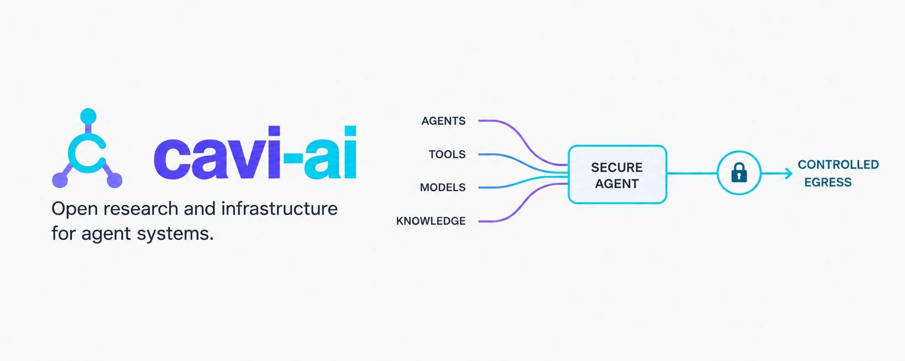

<picture>
  <source media="(prefers-color-scheme: dark)" srcset="./banner-dark.png">
  <source media="(prefers-color-scheme: light)" srcset="./banner-light.png">
  
</picture>

<h2 align="center">Open research and infrastructure for agent systems.</h2>

MIT-licensed tools that make agent runtimes easier to connect, inspect, secure, and trust.

  <a href="https://github.com/cavi-ai/secure-agent"><strong>Secure Agent</strong></a>
  &nbsp;·&nbsp;
  <a href="https://github.com/cavi-ai?tab=repositories"><strong>Repositories</strong></a>
  &nbsp;·&nbsp;
  <a href="https://cavi-ai.xyz/docs"><strong>Documentation</strong></a>
  &nbsp;·&nbsp;
  <a href="https://github.com/cavi-ai/plugins"><strong>Plugins</strong></a>

---

## Start with Secure Agent

[**Secure Agent**](https://github.com/cavi-ai/secure-agent) is an egress-inspection and secret-leak firewall for local AI agents on macOS. It correlates a sensitive-file read with the network egress that follows and flags the leak before a key leaves the machine.

[**View source**](https://github.com/cavi-ai/secure-agent) · [**View releases**](https://github.com/cavi-ai/secure-agent/releases)

---

## Explore the stack

Open building blocks for secure, local, and inspectable agent systems.

| Project | What it does |
| :-- | :-- |
| [**CAVI API Client**](https://github.com/cavi-ai/cavi-api-client) | Gateway-agnostic TypeScript client — agent runtime infrastructure for typed HTTP, WebSocket, and SSE. |
| [**Bobby Browser**](https://github.com/cavi-ai/bobby-browser) | Alpha browser-automation runtime with authenticated, capability-scoped control across Rust, TypeScript, MCP, and CDP. |
| [**MLX Agent**](https://github.com/cavi-ai/mlx-agent) | Discovers, verifies, and wires local MLX-optimized models on Apple Silicon — Claude, Codex, Antigravity, OpenCode, and AgentSkills. |
| [**MLX Workbench**](https://github.com/cavi-ai/mlx-workbench) | Loopback-local UI for the MLX Agent model lifecycle. |
| [**Companion for Claude**](https://github.com/cavi-ai/companion-for-claude) | The Obsidian Community Store release for Claude knowledge workflows. |
| [**Obsidian Agent**](https://github.com/cavi-ai/obsidian-agent) | Portable, CLI-powered Obsidian workflows across agent hosts. |
| [**MCP Eval**](https://github.com/cavi-ai/mcp-eval) | Evidence-driven MCP-server evaluation across discovery cost, schema guessability, error honesty, state recovery, and contention — turning agent friction into actionable findings. |
| [**Ableton MCP**](https://github.com/cavi-ai/ableton-mcp) | Local-first Ableton Live control for MCP clients — Remote Script bridge, stdio MCP server, and CLI with confirm-to-execute mutations. |
| [**CAVI Plugins**](https://github.com/cavi-ai/plugins) | Host-neutral plugin catalog across Claude, Codex, Gemini, OpenCode, and AgentSkills. |
| [**Antigravity for OpenClaw**](https://github.com/cavi-ai/openclaw-antigravity) | OpenClaw provider plugin for Google's Antigravity CLI. |

## Research and verification

- **Agent security** — tying a sensitive-file read to the network egress that follows.
- **Runtime interoperability** — connecting gateways and providers through typed boundaries.
- **Local-first workflows** — running models and knowledge tools on hardware you control.
- **MCP reliability** — measuring discovery cost, schema guessability, error honesty, state recovery, and contention.

## Built in the open

Every public CAVI-AI project ships with its source and provenance. Read the code, test the assumptions, adapt the tools, and contribute what you learn. More work is in development — we publish it when there is working software and evidence worth examining.

  <a href="https://cavi-ai.xyz">cavi-ai.xyz</a>
  &nbsp;·&nbsp;
  <a href="https://github.com/cavi-ai?tab=repositories">all repositories</a>
  &nbsp;·&nbsp;
  <a href="https://github.com/cavi-ai/plugins">plugin catalog</a>

MIT licensed · Source published · Provenance attached

